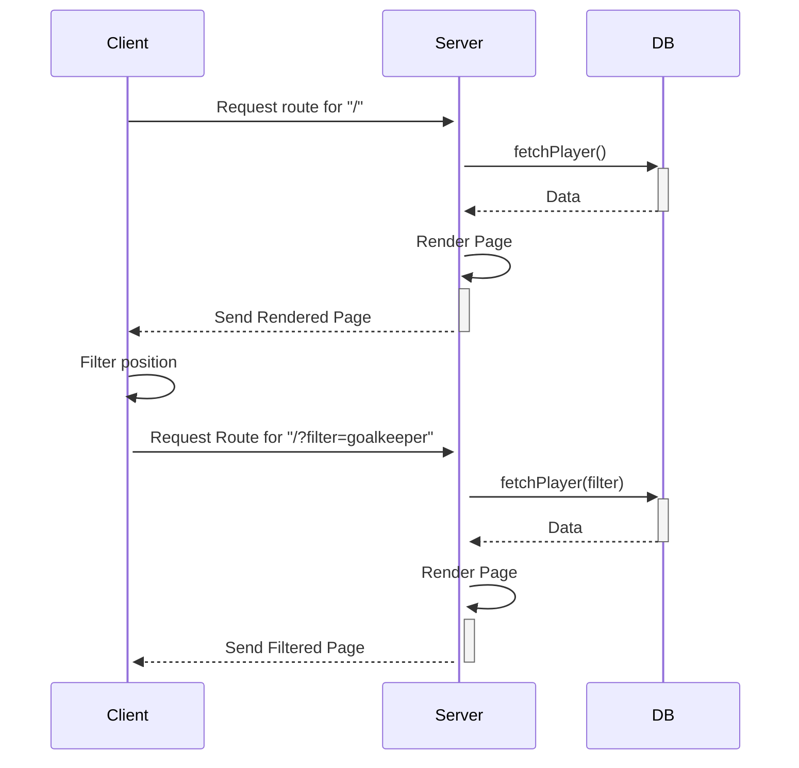

# Solos Technical Assessment

## Overview

This repository has been created to as part of the technical assessment process for Solos.
The tech stack used:

- NextJs 14
- TypeScript
- ESLint
- Prettier
- TailwindCSS
- Storybook (for visual component testing)
- Playwright (for behavior testing)
- Lefthook (for pre-commit)

## Accessing The Live Version

The live version of this repository can be accessed at

[solos-ta.vercel.app](https://solos-ta.vercel.app/)

The Storybook static site of this repository can be accessed at

[rickyxyz.github.io/solos-ta](https://rickyxyz.github.io/solos-ta/)

## Working With The Application Locally

Running the application

```bash
# install the npm packages
npm install

# run the dev server
npm run dev
```

Running Storybook

```bash
# run storybook
npm run storybook
```

Running Playwright's Tests

```bash
# run storybook
npm run test
```

The Lefthook pre-commit hook will run the equivalent of

```bash
npm run prettier
npm run lint
```

## Structure

The repository is organized as follows:

```python
root/
├── types/          # Typescript types and variables
├── app/            # Page level components
│   └── player/
├── components/     # Non-page level components (reusable components)
├── constants/
│   └── mocks/      # Store mock data for development and testing
├── lib/            # Non component functions
│   └── actions/    # NextJs action files
├── __test__/       # Playwright tests
├── stories/        # Storybook stories
├── public/         # NextJs assets
├── .storybook/     # Storybook config
└── .github/        # Github workflows
```

The app folder uses NextJS folder routing system.

## How It Works

NextJS now defaults pages and components to SSR.



## Notes

- This repository was generated from an incomplete version of [my NextJs Boilerplate](https://github.com/rickyxyz/nextjs-boilerplate). Since the boilerplate has not been field tested yet, please keep in mind:
  - **Incomplete Configurations**: Some configurations are still in progress.
  - **Testing Framework**: The testing framework is still experimental and not been tested yet.
